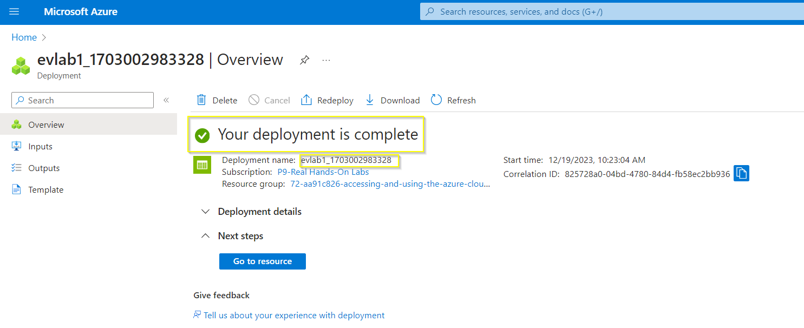
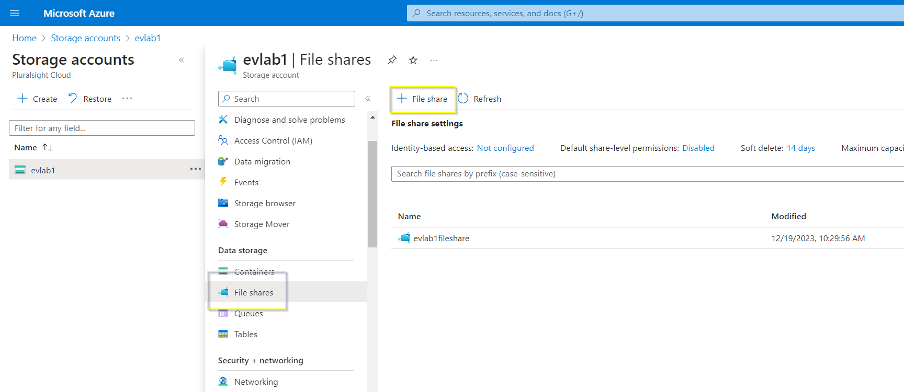
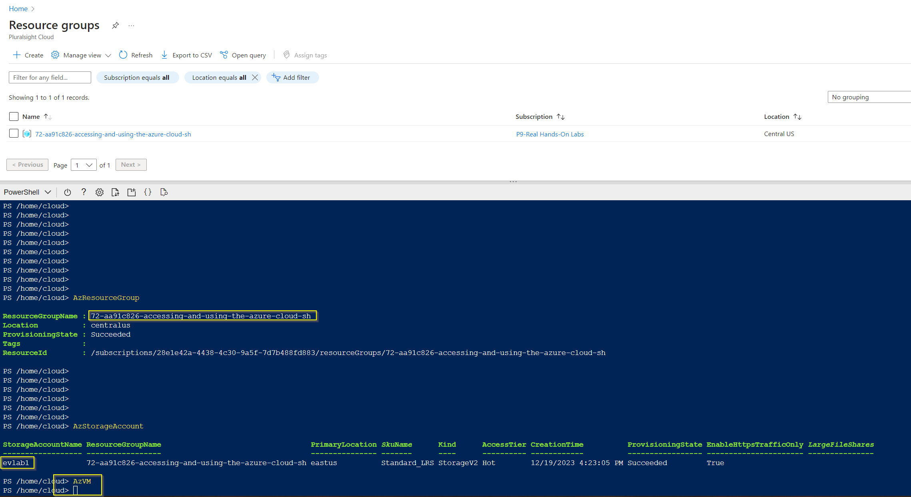
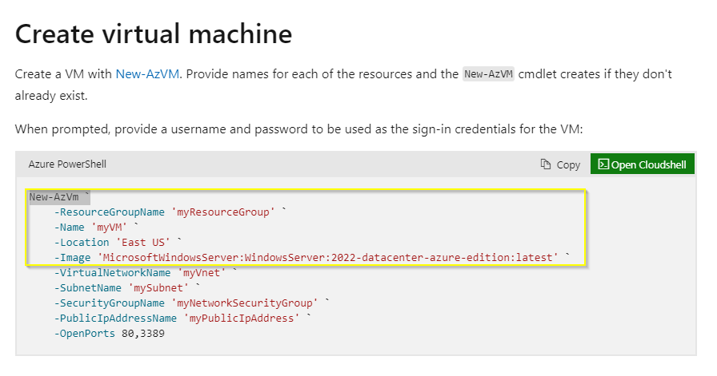
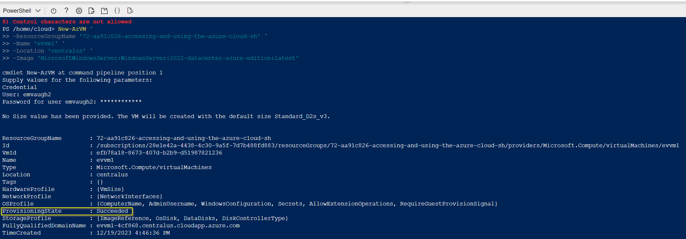
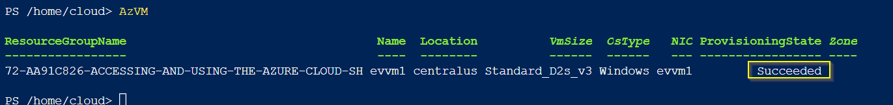
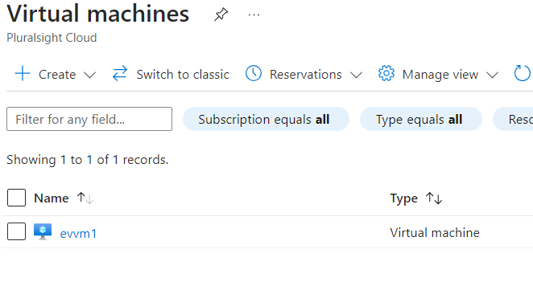
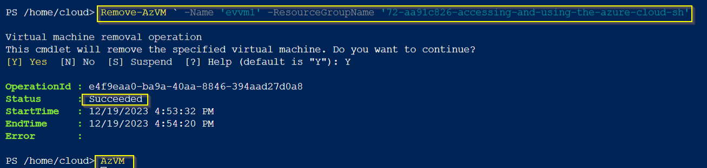

# Creating VMs in Azure

**There are 5 objectives with this lab:**
* Configure Cloud Shell
* Execute Azure CLI Commands in the Cloud Shell
* Create a Virtual Machine Using the Azure CLI
* Run PowerShell cmdlets in the Cloud Shell
* Remove the Virtual Machine

## Configure Cloud Shell

In order to use the Azure Cloud Shell, you have to have a storage account. So create a storage account to start PowerShell. 

You also have to create a File Share. In the Storage Account blade on the left, find File Share. Create a File Share. 

Once you've create a sotrage account and a file share, click the Azure Shell icon. Choose Powershell and then click Advanced Settings. Here, input your storage account and File Share information. PowerShell should start to initialize now.

## Execute Azure CLI Commands in the Cloud Shell

In PowerShell, we can use simple commands such as `AzResourceGroup`, `AzStorageAccount`, and `AzVM` to see the resources that we've created. Our RG was listed and so was the Storage Account that I created for this lab. The AzVM command had no output because we haven't created a VM yet. 

## Create a Virtual Machine Using the Azure CLI

Now, I googled how to create a VM using PowerShell in the Azure Cloud Shell ([link here](https://learn.microsoft.com/en-us/azure/virtual-machines/windows/quick-create-powershell)). The webpage had the following output:

I only chose a few aspects from these parameters since i didn't create a Vnet. I had to create a username and a password. Once that was finished, Azure created the VM. 

## Run PowerShell cmdlets in the Cloud Shell

We can use the PowerShell cmdlet `AzVM` to list the newly created VM. We can also go to the portal and check it there.

## Remove the Virtual Machine

To delete the virtual machine, we just do the reverse of creating it. So instead of `NewAzVM`, we would do `RemoveAzVM` and then specify the name and the RG of our VM. After that action has succeeded, we can use `AzVM` to show that we no longer have the VM we created. 

## Personal Notes

The " ` " character helps make the input more visible. I will definitely be using that. 

Also, I see why people use variables for different parameters such as the subscription and RG. Copy and pasting wasn't working for me (I was probably just doing it wrong) but it would be nice to assign a variable to each of these values and then put the commands in. It's easier to manage. 
